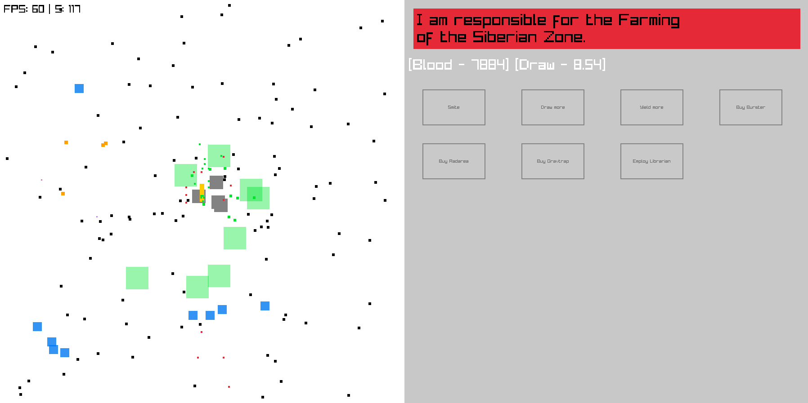
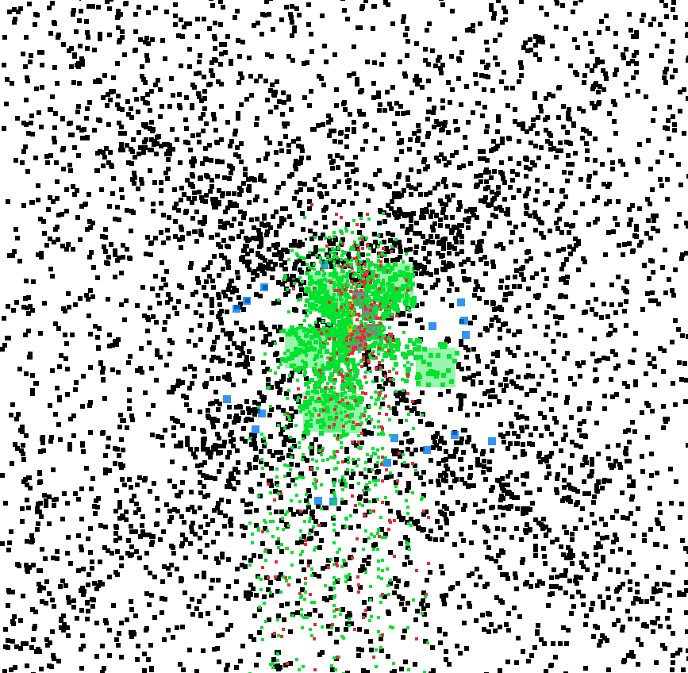

# Torment Nexus II

> Flesh Idle MMOs;
> The machine must grow. It demands more flesh.

This was produced for a small, closed-circle gamejam.

### Idea

Top-down stalker zone simulator.
You are the zone, in the middle stands the monolith.
If anyone reaches the monolith, you loose instantly.

Stalkers and military personel will come.
Currency is their blood.
Clicking on them kills them instantly.
Spawning artifacts increases their spawn probability.
You get to buy anomalies and mutants that guard the zone automatically.

You are saving up for an Emission, marking the end of the game.
